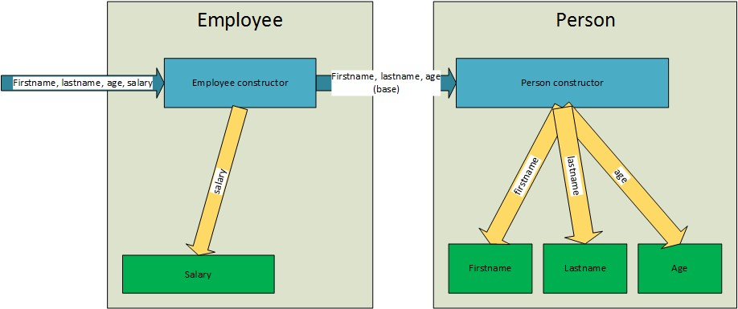
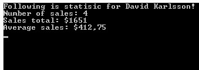
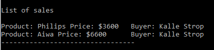
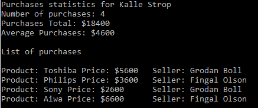

# C# OOP Assignment 1


This assignment should be created in one Visual studio solution with three projects - 
Exercise 1, Exercise 2 and Exercise 3.

Each new class you create in this assignment should be created in a separate file. 

## Exercise 1 
 
### Exercise 1.1 – Creating a class 
Create a class that represents a **person**. Let the class hold information about the 
person first name, last name and age. Let the constructor take in above data as 
parameters.  

### Exercise 1.2 – Adding methods to the class 
Add a method Speak that writes out “Hello my name is {first name} {last name}” to 
the screen when calling it on a person object, where {first name} and {last name} 
is switched out with the actual value stored for the given object. 
 
### Exercise 1.3 – Printing the person class directly 
Try using the Console.WriteLine to write out the **Person** object to the screen by passing 
the object as parameter. That is, Console.WriteLine( personObj ). What is the output?
```
    Excercise_1.Person
```

### Exercise 1.4 – Printing the Person class directly (Continued) 
Now, override the default ToString() method in the *Person* class, and let it return 
the first name, last name and age concatenated. 
Try calling the Console.WriteLine(Person object) and see what happens.  

### Exercise 1.5 – Counting the number of Person-objects created 
In this example, we are going to write the functionality for keeping count of the 
number of *Person* object created. Write a private static integer variable in the *Person*
class named InstanceCount (*I changed this name to _instancCount*), and write a static method named IncreaseInstanceCount that 
increases the InstanceCount variable by one each time the method is called. Also create 
one static method that returns the current InstanceCount value.

Where could you call the IncreaseInstanceCount method, so that it increases the 
InstanceCount each time we create a new person? *I call it from inside the Constructor.*
 
### Exercise 1.6 – Inheritance 
Write an *Employee* class and a *Customer* class that are descendants (subclasses) 
of the *Person* class. Implement a *Salary* property in the *Employee* class.

Create constructors in both classes that calls the base *Person* class constructor 
passing the information it needs (see figure below).

On both the **Employee** class and **Customer** class, override the ToString-method 
and let the method return a string value depending on whether they’re customers or 
employees.

Create a new static method in your Program-class that takes a *Person* object as 
parameter. Inside the method, call the Console.WriteLine-method and pass the 
*Person*-object as parameter. In your main method, call the method with both an 
*Employee* and *Customer* object.  



### Exercise 1.7 – Creating a Sale class 
In this exercise we want to create a class that hold a sale transaction that an employee
makes with a client. The *Sale* class should contain a name of the product sold, the 
price in dollars (double), a *Customer* class property, an *Employee* class property and
a DateTime property that hold the information about when the sale was made. The name 
could for example be *TransactionDate*.

Create a constructor that instantiates the *Sale* object. The date of the sale can be 
created in the constructor as the current date (DateTime.Now). 

Add a property, list of sale objects, in *Employee* class and *Customer* class. 
Implement a collection of Sale objects in both classes’ constructors – **SalesList** 
and **PurchasesList**.

Implement a method in Sale class that adds a new sale to the lists.

**I really don't understand the purpose of adding a NewSale method. This functionality 
should be implemented in the constructor when the Sale is created.**

### Exercise 1.8 – Compute and display sales statistics  
Just storing each sale does not do us much good since the company is interested in how 
many sales an employee has made and how much revenue he have acquired for the company. 
A list of sales made by an employee could also be useful.

To retrieve this information, you are going to create several methods (instance methods) 
in the Employee class that calculates these things.

1. Let the first method be **GetNumberOfSales()**, which returns the number of sales made by an employee.
2. Let the second method be **GetSalesTotal()**, which sums up the revenue for each sale for the employee.  
3. Let the third method compute the average sale revenue for the employee - **GetAverageSale()**.  
4. Then create a method that prints out the sales statistics for a specific employee. 

5. Finally create a method for printing a list of sales made by an employee – **PrintSalesList()**.

6. Optionally, do the same for customers - **PrintPurchasesList()**.


*The previous overrides for ToString() really did not help in these later assignments >:/*

## Exercise 2 - Interfaces: 
 
Create the interface *IDriveable* with these properties and abstract methods:
 
    • string Name 
    • int VehicleSpeed
    • int RemainingFuel
    • void StartEngine(),  
    • void StopEngine(),  
    • void Gas() 
    • void Break() 
    • void TurnLeft() 
    • void TurnRight()
  
Then create 3 classes - Car, Motorbike and Bus. Implement the interface IDriveable on 
all three classes. You do not have to create any real logic inside the methods, just 
print a distinct message like “Turned left (Motorbike)” and “Started the engine (Car)”. 
Some functionality in these methods will be implemented in the next exercise. 

Then create a static method (e.g. TestDrive) that takes an IDriveable object as 
argument that will call the methods on the object in following sequence:

    1. StartEngine() 
    2. Gas() 
    3. TurnLeft() 
    4. TurnRight()  
    5. TurnRight() 
    6. Break() 
    7. StopEngine()

Try calling the method with objects, one from each class.

How could interfaces be beneficial when creating an external library that someone 
else could use? 


## Exercise 3 – Abstract class 
 
Before starting this exercise – copy classes Car, Motorbike, Bus, Program and interface 
IDriveable from Exercise 2.

One other thing that the car, motorbike and Bus share in similarity is that they all 
have an engine, so knowing the amount of fuel they have left, and being able to fill
up the gas is a behaviour that we want for all of them. We also would like to keep 
track of how fast a specific vehicle is currently driving. 

### Excercise 3.1 
Create an abstract class named **EngineVehicle** that implements a property of type 
int that stores the remaining fuel, and a property, Speed, of type int that holds 
kilometres per hour. Implement a backing field (field) for both the speed and the 
fuel property. Make both of the properties virtual.

### Excercise 3.2 
Create a constructor for EngineVehicle that sets the Fuel and Speed to 0.

### Excercise 3.3 
Let the *Car*, *Motorbike* and *Bus* class inherit from the *EngineVehicle* class.

### Excercise 3.4 
Override the fuel and speed properties and make sure that the set-methods of the 
properties checks the following rules for respective subclass. 

    Fuel 
            ◦ A car can hold max 60 litres of fuel 
            ◦ A bus can hold max 150 litres of fuel 
            ◦ A motorbike can hold max 40 litres of fuel 
    Speed 
            ◦ A bus can have a maximum speed of 120 km/hour 
            ◦ A car/motorbike can have a maximum speed of 160 km/hour 
 
### Excercise 3.5 
Make modifications to the methods implemented from the IDriveable so that Gas() and 
Break() accelerates & decelerates the vehicle (changing the speed property value) 
when called. The Gas() method will also drain the fuel with 5 litres for a motorbike, 
10 litres for a car and 15 litres for a bus when accelerating(change the remaining 
fuel property).  

